# Network Programming Project Report
## Multiplayer Texas Hold’em Poker Game (Cardio)

> Note: This report focuses on the **server-side network programming** (C + raw TCP sockets) and the protocol. The Electron + React client is included mainly as a protocol consumer.

---

## Table of Contents

1. [Problem Statement](#1-official-problem-statement)
   - [1.1 Overview](#11-overview)
   - [1.2 Scope of Project](#12-scope-of-project)
   - [1.3 Game Rules (Texas Hold’em)](#13-game-rules-texas-holdem)
2. [Requirement Analysis](#2-requirement-analysis)
   - [2.1 Business Logic](#21-business-logic)
   - [2.2 Use Case Diagram](#22-use-case-diagram)
   - [2.3 Use Case Specifications (Sequence Diagrams)](#23-use-case-specifications-sequence-diagrams)
   - [2.4 Non-Functional Requirements](#24-non-functional-requirements)
3. [Solution](#3-solution)
   - [3.1 System Architecture Design](#31-system-architecture-design)
   - [3.2 Protocol Design](#32-protocol-design)
   - [3.3 Database Design](#33-database-design)
4. [Implementation Details](#4-implementation-details)
   - [4.1 Server Implementation](#41-server-implementation)
   - [4.2 Client Implementation](#42-client-implementation)
5. [Setup Guidelines (Single / Multi-machine on LAN)](#5-setup-guidelines-single--multi-machine-on-lan)
6. [Conclusion and Future Work](#6-conclusion-and-future-work)
7. [Task Allocation](#7-task-allocation)

---

# 1. Official Problem Statement

## 1.1 Overview

This project builds a **multiplayer Texas Hold’em poker game** where multiple clients connect to a single authoritative server over a **persistent TCP connection**. The server is written in **C** using raw Unix sockets and an event-driven I/O model. The client is implemented with **Electron + React + TypeScript**, primarily to validate the protocol and exercise server features.

The project’s core contribution is designing and implementing a **custom application protocol** (documented in `docs/PROTOCOL.md` and client-side in `poker-client/PROTOCOL_IMPLEMENTATION.md`) with:

- Binary framing with a fixed header
- MessagePack payload serialization
- Version handshake
- Authentication & signup
- Lobby/table management
- Multiplayer in-game actions and server-driven game state updates
- Database integration (PostgreSQL) and secure password hashing
- Automated tests (unit tests + end-to-end tests)

## 1.2 Scope of Project

### In scope

- **Networking**: TCP server that accepts multiple concurrent clients and maintains long-lived sessions.
- **Protocol**: request/response and server push messages, versioning handshake, framing, MessagePack payload.
- **Game server**: table creation/joining, turn-based action validation, game state broadcasting.
- **Database**: user accounts stored in PostgreSQL; friend list and scoreboard queries.
- **Security (baseline)**: password hashing using SHA-512 with salt via `libcrypt`.
- **Testing**: unit tests for libraries and E2E clients for protocol flows.
- **Logging**: structured logs to file and colored logs to terminal.

### Out of scope (or partial)

- Client UI polish (the client exists primarily for protocol integration).
- Production-grade security (no TLS in this implementation; see Future Work).
- Some social/gameplay features are present only as “read” endpoints (e.g., friend list retrieval); add/remove/invite/history are listed as use cases but are not fully implemented server-side.

## 1.3 Game Rules (Texas Hold’em)

Texas Hold’em is a community-card poker game:

### Key concepts

- Each player receives **2 private cards** (hole cards).
- The table reveals **5 community cards** in phases.
- A player makes the best **5-card hand** using any combination of hole + community cards.
- Betting occurs in rounds. Players can **fold**, **check**, **call**, **bet**, **raise**, or **all-in**.
- The pot is awarded either when:
  - All other players fold, or
  - At showdown (after final betting), where the best hand wins.

### Phases and betting rounds

1. **Pre-flop**: players receive 2 hole cards; betting round.
2. **Flop**: 3 community cards; betting round.
3. **Turn**: 4th community card; betting round.
4. **River**: 5th community card; betting round.
5. **Showdown**: determine winner(s) if more than one player remains.

### Example (simple)

Assume 3 players A, B, C.

- Pre-flop: A raises 50, B calls 50, C folds.
- Flop: A checks, B bets 30, A calls 30.
- Turn: A bets 100, B folds.
- Result: A wins the pot without showdown.

In this project, the server enforces:

- Turn order (only the active seat may act)
- Action validity (cannot bet lower than min raise, cannot call more than stack, etc.)
- State transitions between betting rounds
- Server-authoritative state broadcasts after actions

> Image placeholder (game flow): **Texas Hold’em Round Flow** (caption: “Pre-flop → Flop → Turn → River → Showdown”) — insert your diagram here.

---

# 2. Requirement Analysis

## 2.1 Business Logic

The system supports the following core business processes:

1. **Account management**
   - Register new users
   - Login with existing accounts
   - Persist account data in PostgreSQL
   - Hash passwords for secure storage

2. **Lobby / table management**
   - Create a table (room) with constraints (max players, minimum bet)
   - List all available tables
   - Join a table
   - Leave a table (partially implemented)

3. **Gameplay**
   - Start game automatically when enough players join
   - Validate and process actions
   - Push updated game state to all connected players in the table

4. **Social and leaderboard**
   - Query scoreboard (leaderboard)
   - Query friend list
   - Add/remove/invite features are treated as planned extensions

## 2.2 Use Case Diagram

> Image placeholder (use case diagram): **Use Case Diagram for Cardio Poker System** (caption: “Actors: Player, Server, Database; Use cases: Register, Login, Create Room, List Room, Join Room, Leave Room, Play Game, View Scoreboard, View Friendlist, etc.”). Insert your prepared image here.

## 2.3 Use Case Specifications (Sequence Diagrams)

### Notation

- `C`: Client (Electron/TypeScript)
- `S`: Server (C, TCP)
- `DB`: PostgreSQL

All requests use the framed protocol:

- Header (5 bytes): `packet_len (u16)`, `protocol_ver (u8)`, `packet_type (u16)` (big-endian)
- Payload: MessagePack map or array

Before normal packets, client performs a version handshake.

#### Global handshake (required)

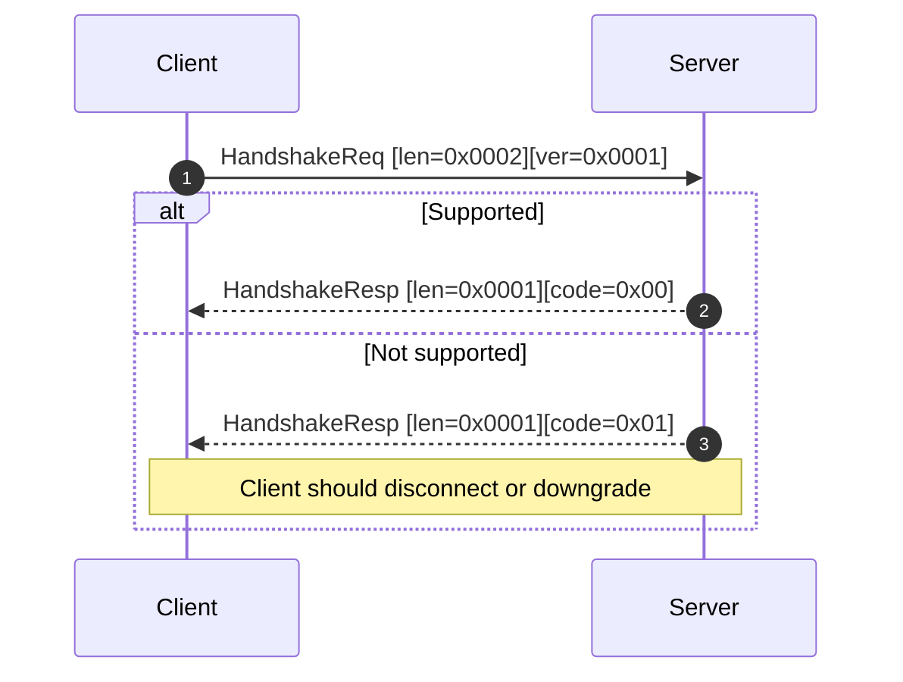

> Implementation note: handshake is implemented in the server event loop (`server/src/main.c`). Some test client comments still say “not implemented” — this is a documentation mismatch, not the server behavior.

---

### Use Case: Login

**Goal:** Authenticate a user and obtain user info.

**Preconditions:** User exists in DB.

**Main flow:**

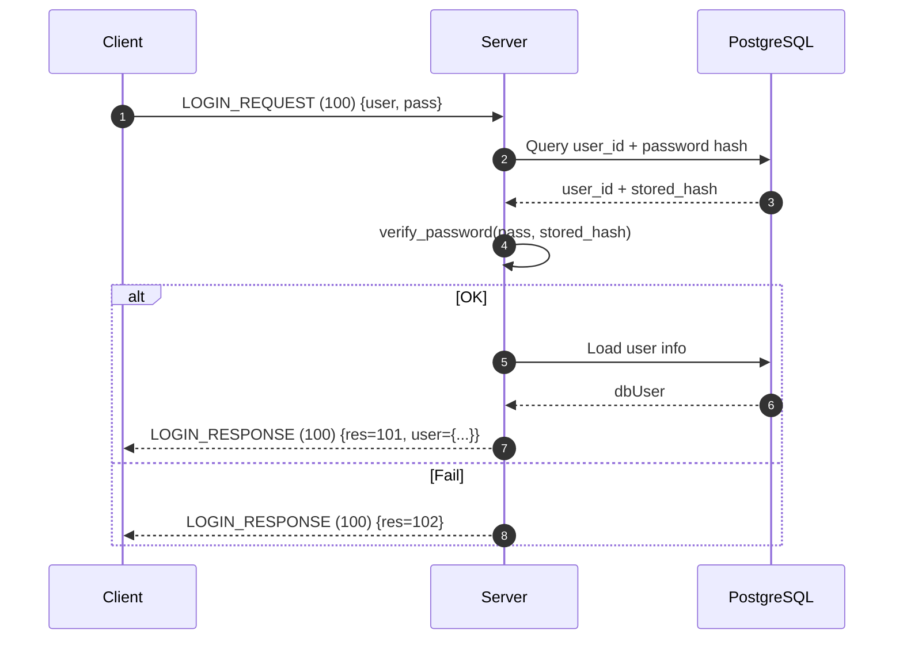

---

### Use Case: Register

**Goal:** Create a new account.

**Preconditions:** Username/email/phone not already used.

```mermaid
sequenceDiagram
    autonumber
    participant C as Client
    participant S as Server
    participant DB as PostgreSQL
    C->>S: SIGNUP_REQUEST (200) {user, pass, fullname, phone, dob, email, country, gender}
    S->>S: Validate username/password format
    S->>DB: Check uniqueness (email/phone/username)
    DB-->>S: none/exists
    alt Unique
        S->>S: salt=generate_salt(); hash=hash_password(pass,salt)
        S->>DB: INSERT User (hashed password)
        DB-->>S: OK
        S-->>C: SIGNUP_RESPONSE (200) {res=201}
    else Conflict / invalid
        S-->>C: SIGNUP_RESPONSE (200) {res=202}
    end
```

---

### Use Case: Create Room (Table)

**Goal:** Create a poker table and automatically join it.

**Preconditions:** User is logged in and not currently at a table.

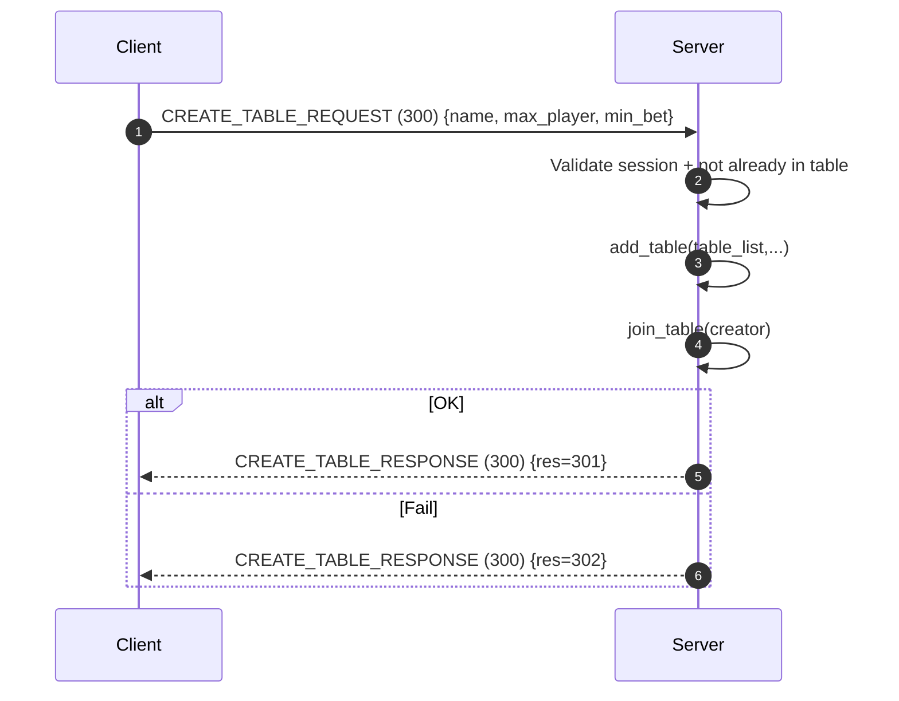

---

### Use Case: List Room (Tables)

**Goal:** Retrieve list of available tables.

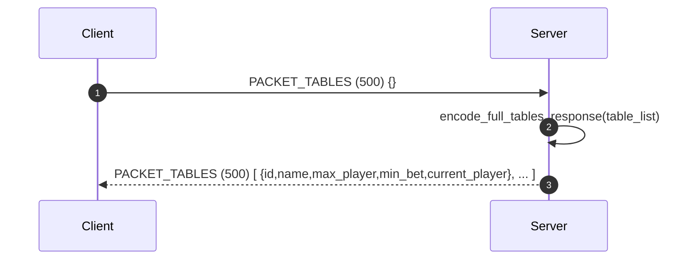

---

### Use Case: Join Room (Join Table)

**Goal:** Join an existing table and receive initial game state.

**Preconditions:** User logged in; table exists; table not full.

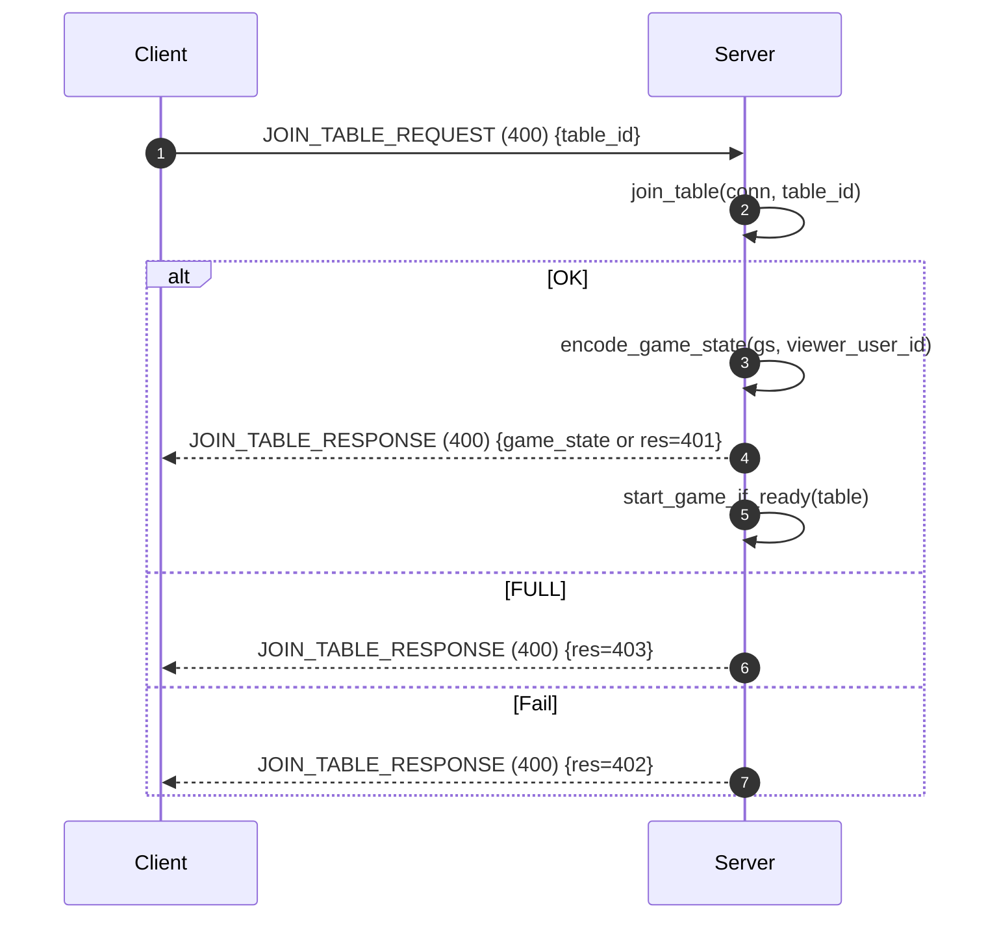

---

### Use Case: Leave Room (Leave Table)

**Status in current server:**

- On disconnect, server calls `leave_table(conn_data, table_list)`.
- Explicit packet handler `handle_leave_table_request(...)` exists but is currently empty.

**Proposed sequence (intended behavior):**

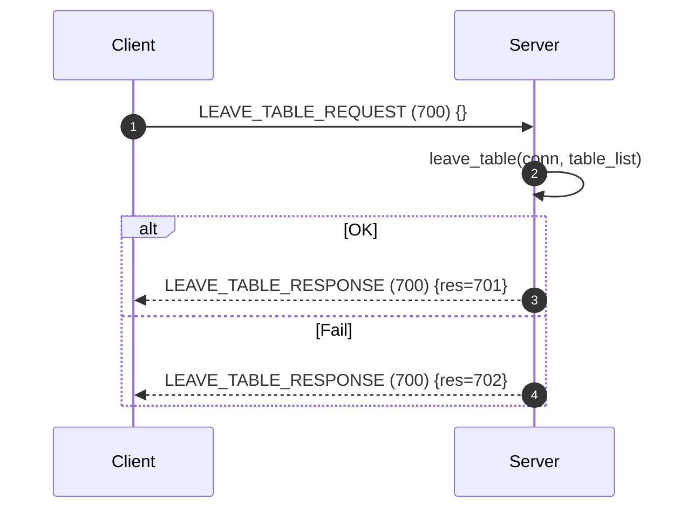

---

### Use Case: Add/Remove Friend

**Status in current server:** not implemented (DB schema supports `Friend(u1,u2)` but no handler packet exists yet).

**Proposed sequence (extension):**

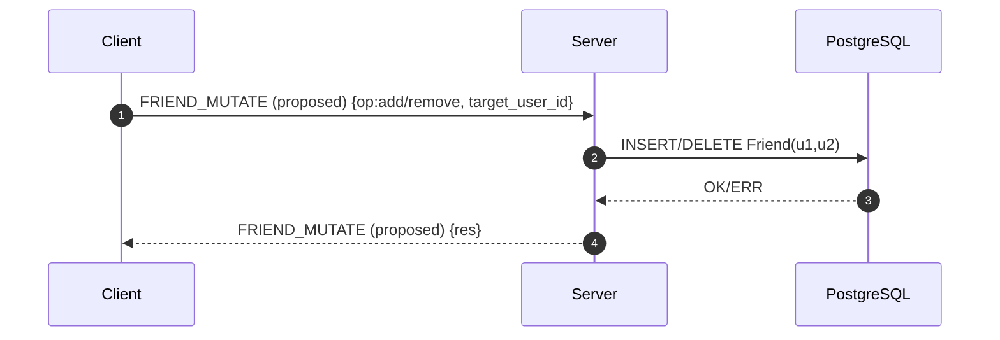

---

### Use Case: Invite Friend

**Status:** not implemented.

**Proposed sequence (extension):**

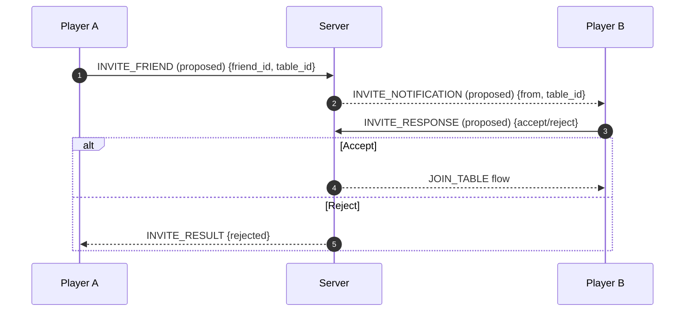

---

### Use Case: Get User Info

**Status:** returned as part of login success response. A dedicated endpoint is not implemented.

**Proposed sequence (optional extension):**

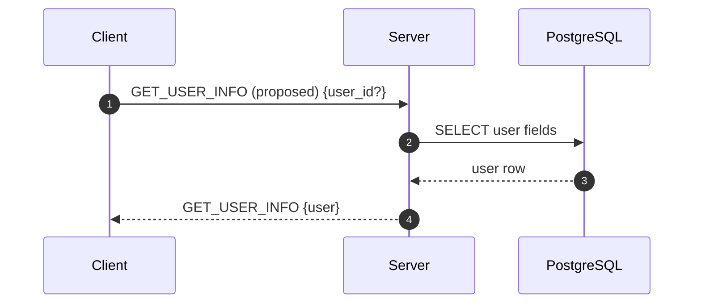

---

### Use Case: View History Gameplay

**Status:** not implemented (no history table in current schema).

**Proposed approach:** persist hand summaries and action logs, then fetch per user.

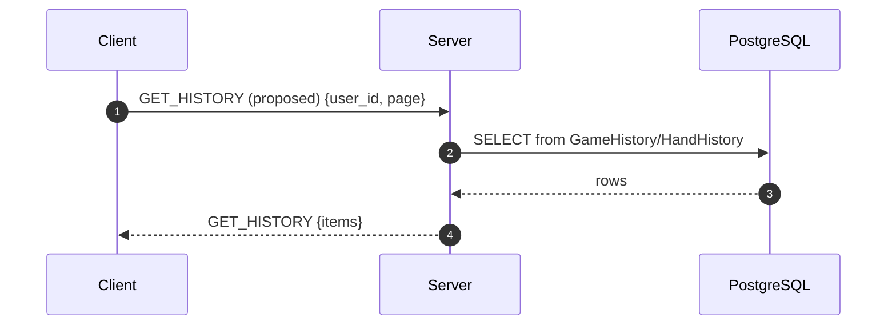

---

### Use Case: Play Game (Main Gameplay Logic)

**Goal:** Player submits an action, server validates it, updates game state, and broadcasts new state.

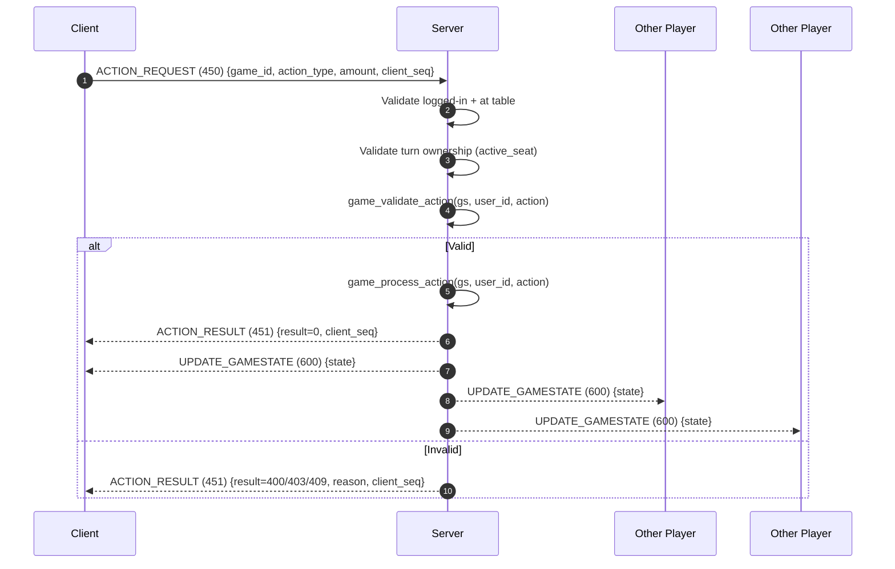

## 2.4 Non-Functional Requirements

### Performance

- Handle many concurrent TCP clients efficiently via non-blocking sockets + `epoll` (edge-triggered).
- Low overhead serialization using MessagePack.

### Reliability

- Server closes dead connections and removes them from epoll.
- Server is authoritative: clients cannot desync game state permanently because server can resend full state.

### Security (baseline)

- Passwords are hashed before storage using SHA-512 salt format (`$6$...`).
- Plain TCP without TLS (acceptable for learning project; must be upgraded for production).

### Maintainability

- C project is split into multiple independent libraries.
- Common testing macros are provided.
- Centralized structured logging.

---

# 3. Solution

## 3.1 System Architecture Design

### High-level client-server architecture

The system is a classic client-server model:

- **Client**: Electron app establishes a TCP socket, performs handshake, then exchanges framed packets.
- **Server**: C server listens on `0.0.0.0:8080`, uses non-blocking sockets and `epoll` to multiplex clients.
- **Database**: PostgreSQL stores users, friends, and balance/scoreboard data.

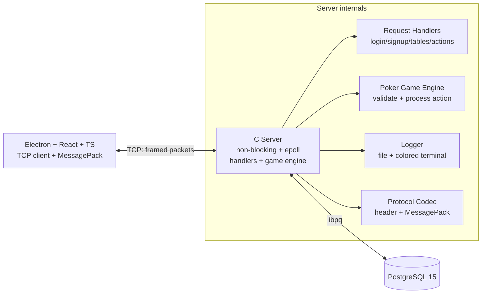

> Image placeholder (deployment): **LAN Deployment Topology** (caption: “One server host runs DB + C server; multiple clients connect over LAN to server IP:8080”). Insert your diagram here.

### Connection model

- Transport: TCP
- Server binding: `0.0.0.0:8080` (accepts remote LAN clients)
- Multiplexing: `epoll` with edge-triggered reads

## 3.2 Protocol Design

### Framing

Packet format (v1) matches `docs/PROTOCOL.md` and server implementation (`server/src/protocol.c`):

```
┌─────────────┬──────────────┬──────────────┬─────────────┐
│ packet_len  │ protocol_ver │ packet_type  │  payload    │
│  (2 bytes)  │  (1 byte)    │  (2 bytes)   │  (variable) │
└─────────────┴──────────────┴──────────────┴─────────────┘
```

- All multi-byte integers are **big-endian** (network byte order).
- Payload is MessagePack unless otherwise stated.

### Version handshake

The server implements handshake in `server/src/main.c`:

- Client sends 4 bytes: `[len=2][protocol_version=0x0001]`
- Server replies 3 bytes: `[len=1][code]`
  - `0x00` OK
  - `0x01` Not supported

### Packet IDs implemented (server)

- `10/11`: PING/PONG
- `100`: LOGIN
- `200`: SIGNUP
- `300`: CREATE_TABLE
- `400`: JOIN_TABLE
- `450`: ACTION_REQUEST
- `451`: ACTION_RESULT
- `500`: TABLES list
- `600`: UPDATE_GAMESTATE (server broadcast)
- `800`: SCOREBOARD
- `900`: FRIENDLIST
- `700`: LEAVE_TABLE exists in protocol constants but handler is currently empty

## 3.3 Database Design

The project uses PostgreSQL. Current schema includes `User` and `Friend` tables (see `database/schemas.sql`).

### DB schema (dbdiagram language)

```dbml
Table User {
  user_id int [pk, increment]
  email varchar(100) [not null, unique]
  phone varchar(15) [not null]
  dob date [not null]
  password varchar(128) [not null]
  country varchar(32)
  gender varchar(10) [not null, note: "Male/Female/Other"]
  balance int [default: 0]
  registration_date date [default: `CURRENT_DATE`]
  avatar_url varchar(100)
  full_name varchar(100) [default: ""]
  username varchar(100) [not null, unique]
}

Table Friend {
  u1 int [not null]
  u2 int [not null]
  indexes {
    (u1, u2) [pk]
  }
}

Ref: Friend.u1 > User.user_id
Ref: Friend.u2 > User.user_id
```

> Note: This schema supports friend relationships. Mutation endpoints (add/remove) are not yet implemented in the server handlers.

---

# 4. Implementation Details

## 4.1 Server Implementation

### 4.1.1 Project structure

The server is organized into multiple libraries under `server/lib/` (e.g., `db`, `logger`, `pokergame`, `mpack`, etc.) and a main executable under `server/src/`.

Typical structure:

```
server/
  include/               # Public server headers
  src/                   # Main server sources (event loop, handlers)
  lib/
    db/                  # PostgreSQL + hashing + queries
    logger/              # Logging
    pokergame/           # Poker engine
    mpack/               # MessagePack implementation
    utils/               # Shared utilities (testing macros)
  test/                  # End-to-end test clients
```

Build strategy:

- CMake builds each library into a static library (e.g., `libCardio_db.a`).
- The main server links these static libraries.

### 4.1.2 MessagePack for serialize/deserialize

MessagePack is used for payloads:

- Server uses MPack (`server/lib/mpack/src/mpack.c`) and the MPack API.
- Encoding example: `mpack_start_map`, `mpack_write_cstr`, `mpack_write_u16`, `mpack_finish_map`.
- Decoding example: `mpack_reader_init_data`, `mpack_expect_map_max`, `mpack_expect_cstr_alloc`, etc.

Advantages:

- More compact than JSON
- Fast binary parsing
- Cross-language support (C server, TS client)

### 4.1.3 Protocol version

- Current version constant: `PROTOCOL_V1 = 0x01`.
- Header includes `protocol_ver` and server expects version `0x0001` during handshake.
- Packet framing functions:
  - `encode_packet(protocol_ver, packet_type, payload, payload_len)`
  - `decode_header(data)`
  - `decode_packet(data, data_len)`

### 4.1.4 Security: Hashing password

Passwords are hashed in the DB layer (`server/lib/db/src/password_hash.c`):

- Uses `crypt_r()` with SHA-512 salt format (`$6$...`).
- `generate_salt()` produces a 16-character salt.
- `hash_password()` stores `crypt_r()` result into DB.
- `verify_password()` checks login password against stored hash.

This ensures:

- DB does not store plaintext passwords.
- Each user has a unique salt embedded into the stored hash.

### 4.1.5 Database connection (`server/lib/db`)

The server uses libpq:

- Connect: `PQconnectdb(dbconninfo)`
- Query: `PQexec(conn, sql)`
- Check result: `PQresultStatus(res)`
- Read fields: `PQgetvalue(res, row, col)`
- Cleanup: `PQclear(res)` and `PQfinish(conn)`

Important DB operations:

- `dbSignup(conn, user)` validates + hashes password + inserts user
- `dbLogin(conn, username, password)` verifies password hash
- `dbGetUserInfo(conn, user_id)` used during login success response
- `dbGetScoreBoard(conn)`
- `dbGetFriendList(conn, user_id)`

### 4.1.6 Handlers (`server/src/handler.c`)

The server dispatches requests in the main loop based on `header->packet_type`.

Key handlers:

- `handle_login_request()`
  - Decodes login request
  - Calls DB login + fetches user info
  - Sends login success payload

- `handle_signup_request()`
  - Decodes signup request
  - Calls DB signup (includes hashing)
  - Sends `R_SIGNUP_OK`/`R_SIGNUP_NOT_OK`

- `handle_create_table_request()`
  - Validates logged-in + not already in table
  - Creates table, joins creator

- `handle_get_all_tables_request()`
  - Encodes current `TableList` into an array payload

- `handle_join_table_request()`
  - Validates
  - Joins table
  - Encodes full game state to the joining player
  - Calls `start_game_if_ready(table)`

- `handle_action_request()`
  - Decodes `ActionRequest` (`fold/check/call/bet/raise/all_in`)
  - Ensures “your turn” using `active_seat`
  - Validates and processes action using poker engine
  - Sends `ACTION_RESULT`
  - Broadcasts full `UPDATE_GAMESTATE` to all players at the table

- `handle_leave_table_request()`
  - Present but currently empty (future completion)

### 4.1.7 Testing: Unit test + E2E test

#### Unit tests

- Test helper macros are defined in `server/lib/utils/testing.h`:
  - `TEST(name)`, `RUN_TEST(name)`, `ASSERT(expr)`, `ASSERT_STR_EQ(a,b)`
- Libraries include their own tests (e.g., `server/lib/logger/test/unit_tests.c`, `server/lib/db/test/unit_test.c`).

#### End-to-end tests

- `server/test/e2e_test_client.c`: exercises signup/login/table flows.
- `server/test/e2e_multiplayer_test.c`: 3-player scenario with multiple rounds and action sequences.

> Note: the E2E client has a comment that handshake is “not implemented”, but the server **does implement** handshake; update the test client docs if needed.

### 4.1.8 Logging (`server/lib/logger`)

Logging is implemented as a standalone library:

- File output: appends to `server.log`
- Terminal output: optional, with color coding by level
- Structured format:
  - `[TAG] YYYY-MM-DD HH:MM:SS [function_name] message`

Example:

```
[INFO] 2026-01-07 22:28:36 [get_listener_socket] Listener socket created successfully on 0.0.0.0:8080
```

## 4.2 Client Implementation

The Electron client in `poker-client/` is a protocol consumer:

- Uses Node.js TCP sockets (`net`) inside Electron.
- Uses MessagePack (`@msgpack/msgpack`) for payload encoding/decoding.
- Implements packet framing exactly as the server.
- Implements authentication (login/signup) and basic navigation.

> Image placeholder (client view): **Client Login/Signup Screens** (caption: “Client UI for protocol testing; UI is not the main focus”).

---

# 5. Setup Guidelines (Single / Multi-machine on LAN)

This section is aligned with `README.md`.

## 5.1 Prerequisites (server host)

- Linux/Unix environment
- `clang`, `cmake >= 3.22`
- `libpq-dev`, `libcrypt-dev`, `clang-tools`
- Docker + Docker Compose (for PostgreSQL)

## 5.2 Start database

From repository root:

```sh
docker compose up -d
```

Default DB:

- host: `localhost`
- port: `5433`
- database: `cardio`
- user/pass: `postgres/postgres`

## 5.3 Build and run server

```sh
chmod u+x ./server/build_all.sh
chmod u+x ./server/clean_build.sh

make build
./server/build/Cardio_server
```

The server listens on `0.0.0.0:8080` so other machines on the LAN can connect.

## 5.4 Run clients on the same LAN (multi-machine)

### On the server machine

1. Ensure DB is running via Docker.
2. Run the server executable.
3. Confirm firewall allows inbound TCP on port `8080`.

### On each client machine

1. Ensure the client machine can reach the server machine IP.
2. Start the Electron client and configure it to connect to:
   - host = `<server LAN IP>`
   - port = `8080`
3. Perform handshake, then login/signup.

> Image placeholder (setup): **Multi-machine Setup Screenshot** (caption: “Server terminal + 2+ client machines connected over LAN”).

---

# 6. Conclusion and Future Work

## Conclusion

This project demonstrates a complete end-to-end network programming system for a multiplayer card game:

- Event-driven TCP server with `epoll`
- Versioned handshake and framed binary protocol
- MessagePack serialization across languages
- PostgreSQL persistence and secure password hashing
- Automated tests from unit to E2E
- Maintainable modular C architecture using static libraries

## Future work

- Implement explicit `LEAVE_TABLE` handler (packet 700).
- Add TLS support (OpenSSL) to secure transport.
- Add prepared statements / parameterized queries to harden DB access.
- Implement friend mutation + invitation flows.
- Add gameplay history persistence and retrieval.
- Add incremental “update bundles” (460) instead of broadcasting full state (600) every time.

---

# 7. Task Allocation

> Assignee column is intentionally left blank for later assignment.

| Assignee | Scope | Task name | Description | Estimation (man-days) |
|---|---|---|---|---:|
|  | Protocol | Handshake conformance | Ensure client tests match server handshake; update E2E client docs and add handshake test | 0.5 |
|  | Protocol | Update bundle (460) | Implement incremental state updates and reduce bandwidth vs full state broadcast | 3 |
|  | Server | Leave table handler | Implement `handle_leave_table_request` and broadcast player-leave events | 1.5 |
|  | Server | Friend add/remove | Add protocol packets + handlers + DB functions for friend mutation | 3 |
|  | Server | Invite friend | Implement invite push notifications and accept/reject join flow | 4 |
|  | Database | Gameplay history | Add tables for hands/actions and implement history queries | 4 |
|  | Security | TLS transport | Add TLS wrapper for sockets, certificate handling, and secure client connection | 5 |
|  | Testing | Expand E2E gameplay | Add more scenarios: reconnect/resync, side pots, all-in, showdown cases | 3 |
|  | DevOps | Multi-machine guide | Add docs + sample configs for running on LAN; firewall notes | 1 |
